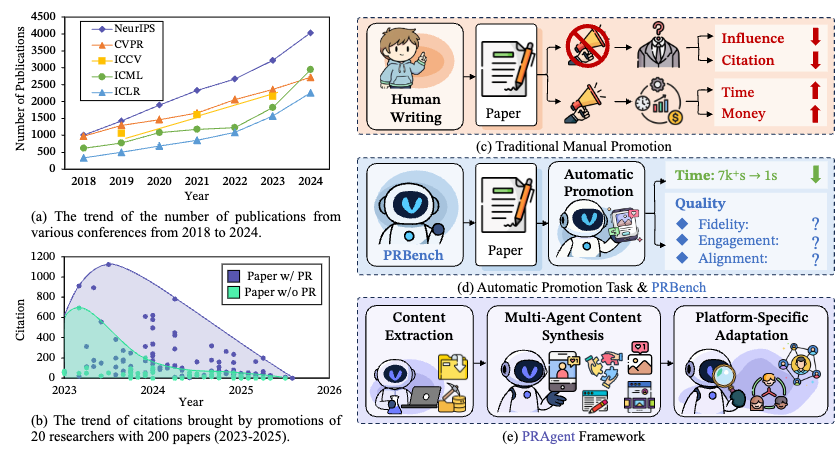
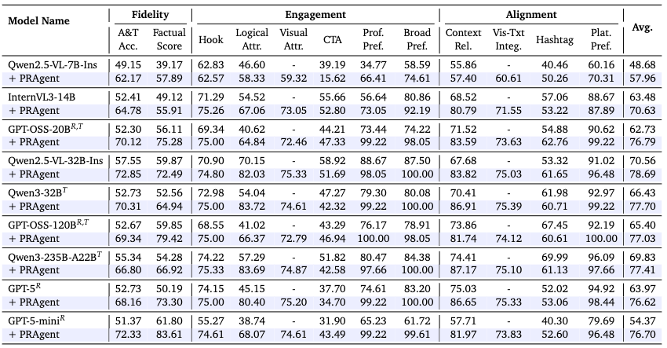
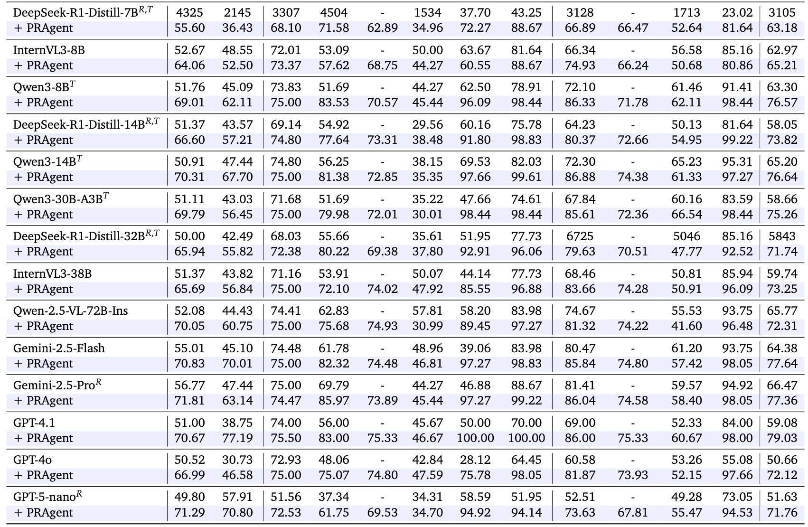
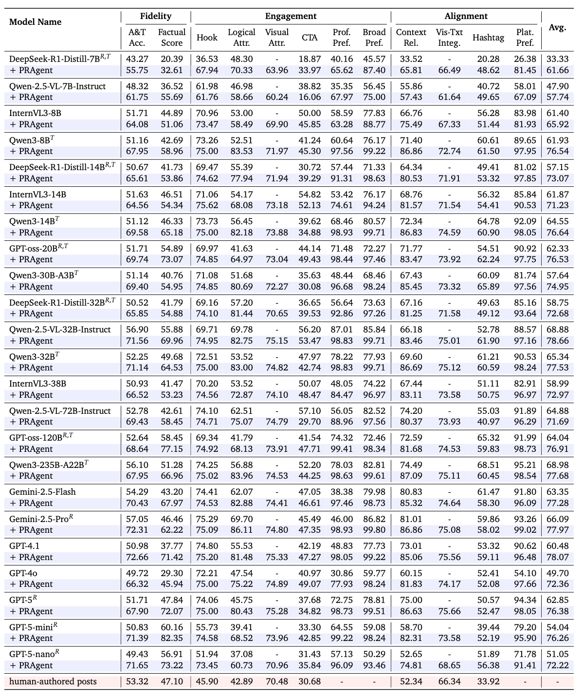

<p align="center">
<h1 align="center"> 🎉 AutoPR: Let's Automate Your Academic Promotion!</h1>
</p>
<p align="center">
  	<a href="https://github.com/LightChen233/AutoPR">
      
    </a>
    <a href="ttps://github.com/LightChen233/AutoPR">
       
  	</a>
   	<a href="https://github.com/LightChen233/AutoPR/stargazers">
       
  	</a>
  	<a href="https://github.com/LightChen233/AutoPR/network/members">
       
  	</a>
    <a href="https://github.com/LightChen233/AutoPR/issues">
      
    </a>
    <br />
    
</p>

<p align="center">
  	<b>
    | [<a href="https://arxiv.org/abs/XXX">📝 ArXiv</a>] | [<a href="https://github.com/LightChen233/AutoPR">📚 Github Code</a>] | [<a href="https://huggingface.co/datasets/LightChen2333/PRBench">🤗 PRBench</a>] | [<a href="https://huggingface.co/datasets/LightChen2333/PRBench">🔥 PRAgent Demo</a>] |
    </b>
    <br />
</p>


This is the official implementation for **"AUTOPR: LET'S AUTOMATE YOUR ACADEMIC PROMOTION\!"**.


## 👀 Overview
As the volume of peer-reviewed research surges, scholars increasingly rely on social platforms for discovery, while authors invest significant effort in promotion to sustain visibility and citations. This project aims to address that challenge.


We formalize **AutoPR (Automatic Promotion)**, a new task to automatically translate research papers into faithful, engaging, and well-timed public-facing content. To accomplish this, we developed **PRAgent**, a modular agentic framework for automatically transforming research papers into promotional posts optimized for specific social media platforms.



## 🔥 News
- **[2025-10-08]** Our 🔥🔥 **PRAgent** 🔥🔥 and 🔥🔥 **PRBench** 🔥🔥 benchmark is released! You can download the dataset from here.


## 🏅 Leaderboard

### PRBench-Core


### PRBench-Full



## 🛠️ Installation

1.  Create and activate a Conda environment (recommended):

    ```bash
    conda create -n autopr python=3.11
    conda activate autopr
    ```

2.  Install the required dependencies:

    ```bash
    pip install -r requirements.txt
    ```

-----

## ⚙️ Configuration

Before running the code, you need to configure your Large Language Model (LLM) API keys and endpoints.

Create Edit the `.env` file with your API credentials:

```python
# Main API Base URL for text and vision models (e.g., OpenAI, Qwen, etc.)
OPENAI_API_BASE="https://api.openai.com/v1"
# Your API Key
OPENAI_API_KEY="sk-..."
```

The scripts will automatically load these environment variables.

-----

## ⚡ PRBench Evaluation

The entire workflow, from generation to evaluation, is managed through simple shell scripts.

### Step 0: Preparation

```bash
chmod +x script/data_process.sh
./script/data_process.sh
```

You still need to download the [DocLayout-YOLO](https://huggingface.co/juliozhao/DocLayout-YOLO-DocStructBench/blob/main/doclayout_yolo_docstructbench_imgsz1024.pt) model to ``pragent/model``.Alternatively, you can modify the model path in the ``pragent/backend/figure_table_pipeline.py`` file

### Step 1: Generate Promotional Posts (PRAgent)


First, prepare your input directory. The script automatically determines the target platform based on the **folder name**:

* **Numeric** folder name -\> **Twitter (English)**
* **Alphanumeric** folder name -\> **Xiaohongshu (Chinese)**

<!-- end list -->

```python
/path/to/your/papers/
├── 12345/               # Numeric -> will generate a Twitter-style post in English
│   └── paper.pdf
└── some_paper_name/     # Alphanumeric -> will generate a Xiaohongshu-style post in Chinese
    └── paper.pdf
```

If you have run Step 0, you can use the ``eval/data/input_pdf`` folder as input

Next, configure and run the generation script.
```bash
chmod +x scripts/run_pragent.sh
./script/run_generation.sh
```

### Step 2: Evaluate Post Quality (PREval)

After generation, use the evaluation script to assess the quality of the posts in your output directory.

```bash
chmod +x scripts/run_eval.sh
./scripts/run_eval.sh
```

### Step 3: Calculate and View Metrics

Finally, run the calculation script to aggregate the raw evaluation data into a formatted results table.

```bash
chmod +x scripts/calc_results.sh
./scripts/calc_results.sh
```

## 🕹️ PRAgent Generation


## ☎️ Contact
If interested in our work, please contact us at:
- Qiguang Chen: charleschen2333@gmail.com
- Zheng Yan: xxx

## 🎁 Citation
```
@misc{chen2025autopr,
      title={AutoPR: Let's Automate Your Academic Promotion!}, 
      author={Qiguang Chen and Zheng Yan and Mingda Yang and Libo Qin and Yixin Yuan and Hanjing Li and Jinhao Liu and Yiyan Ji and Dengyun Peng and Jiannan Guan and Mengkang Hu and Yantao Du and Wanxiang Che},
      year={2025},
}
```
